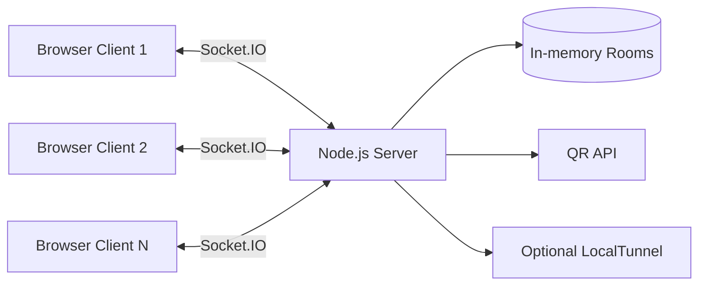

<div align="center">
	
</div>

## Overview

CollabIT is a modern realtime workspace for teams that need low-latency collaboration. It combines collaborative text editing, live chat, user presence, and a compact shared whiteboard in one browser interface.

## Tech Stack

### Core Technologies

| Technology | Version | Purpose |
|---|---|---|
|  **Node.js** | 18+ | Runtime environment |
|  **Express.js** | 4.x | Web server framework |
|  **Socket.IO** | 4.x | Realtime communication |
|  **JavaScript** | ES6+ | Language |
|  **HTML5** | — | Markup |
|  **CSS3** | — | Styling |

### Utilities & Tools

| Tool | Version | Purpose |
|---|---|---|
|  **npm** | 10+ | Package manager |
| **qrcode** | 1.5.x | QR code generation |
| **localtunnel** | 2.0.x | Public tunneling |
| **nodemon** | — | Development auto-reload |

### Deployment

| Platform | Version | Role |
|---|---|---|
|  **GitHub** | — | Version control & hosting |
| **LocalTunnel** | 2.0.x | Remote access |

## Feature Set

- Realtime collaborative text editing (OT-style server reconciliation)
- Presence and live user list
- Cursor and typing indicators
- Room chat with user color identity
- Mini collaborative whiteboard:
	- pen
	- eraser
	- color picker
	- brush size
	- clear board
- Invite workflow with QR code generation
- Public tunnel support for cross-device sharing

## Dependency Structure

### Runtime dependencies

| Package | Purpose |
|---|---|
| express | HTTP server, static file serving, and REST endpoints |
| socket.io | Bidirectional realtime communication between clients and server |
| qrcode | Server-side PNG QR generation for share links |
| localtunnel | Temporary public URL exposure for remote device access |

### Development dependencies

| Package | Purpose |
|---|---|
| nodemon | Auto-restart server during development |
| socket.io-client | Programmatic clients for smoke testing |

## Architecture

### High-level flow



### Realtime data model per room

- content: current text snapshot
- version: document version counter
- history: operation history used for transforms
- users: connected user metadata map
- whiteboardStrokes: shared whiteboard stroke list

### Project layout

```text
collab-editor/
|- server.js
|- package.json
|- package-lock.json
|- public/
|  `- index.html
|- scripts/
|  `- multiuser-smoke.js
`- screenshots/
	 |- Screenshot 2026-04-24 001110.png
	 |- Screenshot 2026-04-24 001223.png
	 `- Screenshot 2026-04-24 001254.png
```

## Installation and Setup

### Requirements

- Node.js 18 or newer
- npm 9 or newer

### 1) Install dependencies

```bash
npm install
```

### 2) Run the app

```bash
npm start
```

Open http://localhost:3005

### 3) Development mode (auto reload)

```bash
npm run dev
```

### 4) Run without public tunnel

```bash
npm start -- --no-tunnel
```

## Runtime Configuration

### Environment variables

- PORT: server port (default: 3005)
- DISABLE_TUNNEL: set to 1, true, or yes to disable LocalTunnel
- TUNNEL_HOST: custom tunnel host override

### CLI flags

- --no-tunnel
- --tunnel-host=<host>

## NPM Scripts

| Script | Command | Description |
|---|---|---|
| start | node server.js | Start server in normal mode |
| dev | nodemon server.js | Start server with watch/restart |

## Testing

Run the smoke test:

```bash
node scripts/multiuser-smoke.js
```

It checks:

- multi-client room join
- user visibility propagation
- chat broadcast correctness

## Screenshots

<table>
  <tr>
    <td width="33%" align="center">
      <strong>Main UI</strong><br/>
      
    </td>
    <td width="33%" align="center">
      <strong>Invite Modal</strong><br/>
      
    </td>
    <td width="33%" align="center">
      <strong>Whiteboard</strong><br/>
      
    </td>
  </tr>
</table>

## Security and Production Notes

This repository is optimized for fast local collaboration. For production rollout, add:

- authentication and room authorization
- event-level rate limiting and payload caps
- persistent datastore with bounded retention
- strict CORS origin allowlist
- security headers and reverse proxy hardening

## Roadmap

- Whiteboard undo/redo and shape tools
- Rich-text editor integration
- Durable document persistence
- Horizontal scaling with Redis adapter
- Role-based moderation and access control
